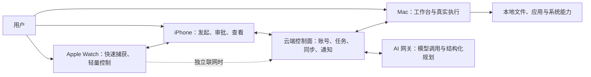
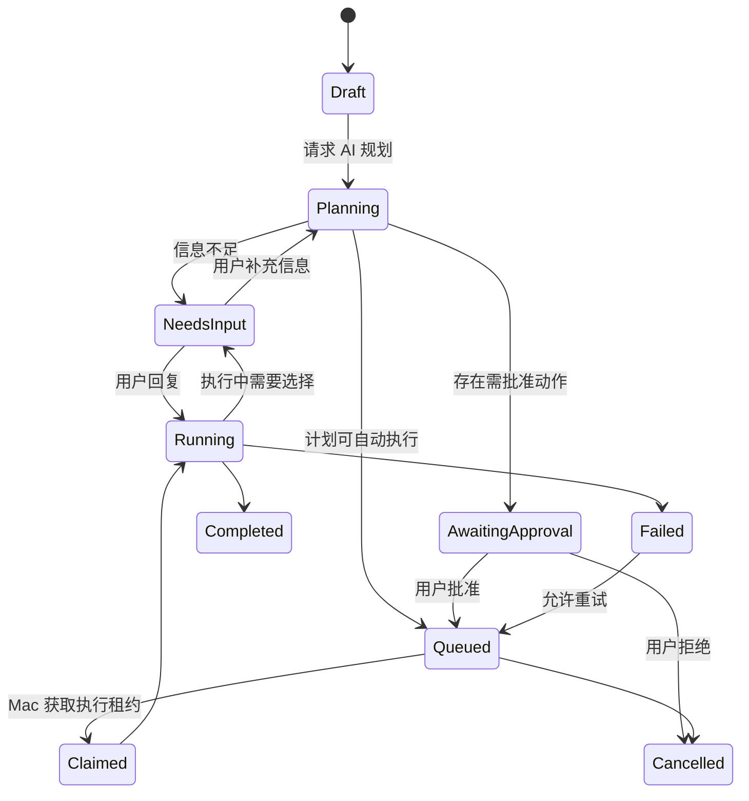
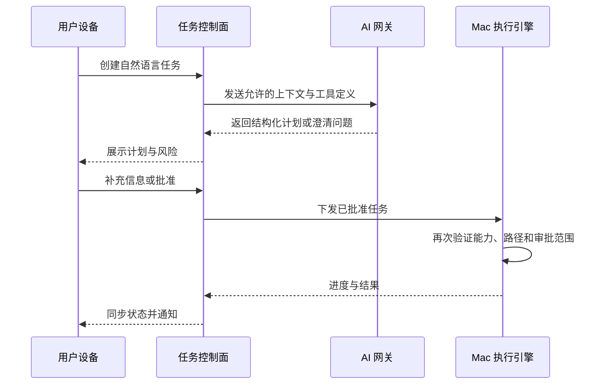

# 桌序 · Xulora 产品说明

> 从 macOS 桌面文件整理出发，演进为连接 AI、iPhone 与 Apple Watch 的个人工作台

| 项目 | 内容 |
| --- | --- |
| 文档版本 | 1.1 |
| 产品版本 | V0.1 |
| 文档状态 | 可进入原型与开发 |
| 首发平台 | macOS 26 及以上 |
| 未来平台 | iOS、watchOS |
| 当前使用环境 | macOS 27 |
| 当前使用范围 | 单用户、自用、非商业化 |
| 长期方向 | 可商业化的个人工作台与多设备任务系统 |
| 产品原则 | 简单、高效、本地优先、安全可靠 |
| 中文名 | 桌序 |
| 英文名 | Xulora |
| 完整品牌写法 | 桌序 · Xulora |
| App 显示名 | 桌序 |
| 工程名 | Xulora |
| 建议 Bundle ID | `com.<主体>.xulora` |

---

## 1. 产品概述

### 1.1 一句话定义

桌序（Xulora）是一个以文件整理为核心的 macOS 私人桌面工作台。用户可以把真实文件夹以桌面组件的形式长期放在桌面上，直接完成文件查看、移动、复制和打开，同时使用便签、待办、时钟与番茄钟处理日常信息和专注任务。

### 1.2 产品背景

macOS 的 Finder、Dock、Spotlight 和系统小组件分别解决文件浏览、应用启动、搜索和信息展示问题，但它们没有提供一个始终位于桌面的、可直接操作的个人工作区。

桌序不试图替代 Finder，也不追求组件市场或高度可编程性。它解决的是一个更具体的问题：把用户当前最需要处理的文件与信息放在桌面上，减少打开窗口、切换应用和寻找目录的成本。

### 1.3 核心价值

1. **文件随手归位**：把文件拖进桌面上的目标区域，即可移动或复制到对应真实文件夹。
2. **状态一眼可见**：当前文件、待办、便签和专注状态始终可见。
3. **操作一步完成**：无需先打开 Finder 或其他应用，再寻找目标位置。
4. **本地拥有数据**：V0.1 不登录、不上传、不依赖网络；未来接入云端时，真实文件仍由用户设备和文件系统拥有，云端只保存必要的同步、任务和 AI 请求数据。
5. **长期运行安静可靠**：不抢焦点、不遮挡正常工作窗口、低资源占用。
6. **跨设备协作**：未来可以从 iPhone 或 Apple Watch 捕获意图、创建任务和查看状态，由可信 Mac 完成实际处理。
7. **AI 辅助而非越权执行**：云端大模型负责理解、规划和生成内容，本地执行引擎负责权限判断和动作执行。

### 1.4 品牌命名

#### 正式名称

- 中文名：**桌序**
- 英文名：**Xulora**
- 中英文组合：**桌序 · Xulora**
- 中文产品定义：**以文件整理为核心的 macOS 私人桌面工作台**

#### 名称读音

`Xulora` 建议读作 `zu-LOR-ah`，中文近似“祖-洛拉”。对外传播时保持该读音，不根据地区改写拼法。

#### 命名逻辑

- `Xu` 呼应中文“序”，保留中英文品牌之间的意义联系。
- `Xulora` 是品牌造词，不直接使用 `Desk`、`Widget`、`File`、`Tidy` 或 `Sort` 等描述性单词。
- 造词比直接描述产品功能的名称更容易形成独立品牌识别，也不会把未来能力限制在桌面、文件或小组件之内。
- 拼写简短，适合 App 名称、图标字标、网站、社交账号和商标主体。
- 品牌含义围绕“秩序、归位、本地工作空间”，但产品对外不需要逐字解释词源。

#### 品牌标语

- 中文：**让一切各归其位。**
- 英文：**Everything in its place.**

#### 品牌使用规则

- macOS App 显示名称使用“桌序”，降低中文用户的理解成本。
- 官网、关于页面和正式介绍使用“桌序 · Xulora”。
- 代码工程、可执行文件、仓库和技术文档使用 `Xulora`。
- Bundle ID 建议使用 `com.<注册主体或个人标识>.xulora`，正式发布前替换占位部分。
- 不再使用 `DeskCanvas`、`Deskweave` 或其他含 `Desk` 的候选名。
- 产品图标和字标不得沿用 DeskWidgets 的名称结构或视觉资产。

#### 初步冲突检查

截至 2026 年 8 月的公开网络初步检索中，没有发现明显的同名 `Xulora` 软件或 App。精确名称的主要公开结果是生物分类中的 `Xulora` 属，与计算机软件领域存在明显类别差异。该结果只用于早期名称筛选，不构成商标可注册性结论。

#### 商业化前的名称核验

在任何公开发布、收费、成立主体或投入品牌设计费用之前，应完成一次正式的商标与名称清查：

1. 查询中国国家知识产权局商标数据库中的完全相同和近似名称。
2. 至少覆盖第 9 类（可下载计算机软件）和第 42 类（软件设计、开发或在线软件服务）。
3. 如果未来提供在线市场、订阅销售或推广服务，再评估第 35 类。
4. 检查 `Xulora` 的近似拼写、近似读音和大小写变体，而不只查询完全一致的字符串。
5. 根据计划进入的市场查询 WIPO Madrid Monitor、USPTO、EUIPO 等数据库。
6. 检查 App Store、主流搜索引擎、GitHub、公司注册名称、域名和社交媒体账号。
7. 在提交商标申请或正式商业化前，由商标代理人或知识产权律师完成最终判断。

公开搜索只能排除明显冲突，不能保证商标一定可以注册，也不能替代专业法律意见。

---

## 2. 第一性原理与产品边界

### 2.1 基础事实

- 文件的真实内容和目录结构由 macOS 文件系统管理。
- Finder 管理桌面原生图标的位置与行为，第三方应用不应把覆盖 Finder 图标作为核心实现方式。
- 用户整理文件的最终结果必须是文件进入明确的真实目录，而不是只在应用内部形成一份虚拟分类。
- 桌面组件的价值来自低访问成本，而不是组件数量。
- V0.1 只服务一个用户和一台主要 Mac，不需要账号、云端和多租户；长期架构需要支持同一用户的 Mac、iPhone 与 Apple Watch 协作。
- 文件移动、替换与删除可能造成数据损失，因此可靠性优先于操作速度。

### 2.2 推导出的产品决策

- 每个文件整理组件必须绑定一个真实文件夹。
- 文件夹是唯一事实来源，应用不复制维护一份文件数据库。
- 应用卸载或损坏不能影响已整理的文件。
- V0.1 不在 Finder 桌面图标周围绘制所谓“桌面分区”。
- V0.1 不建立插件系统、云同步、账号或后台服务。
- 后续版本引入云端和移动端之前，必须先建立统一任务模型、本地执行引擎、风险分级和审计记录。
- 所有危险操作必须可感知、可取消，删除只允许进入系统废纸篓。
- 功能设计首先优化个人使用效率，不为兼容旧系统或其他用户增加复杂度。

---

## 3. 产品目标与非目标

### 3.1 V0.1 产品目标

- 提供稳定的 macOS 桌面组件容器。
- 支持多个独立的文件整理组件。
- 支持从 Finder 拖入文件并移动或复制到目标文件夹。
- 支持在不同文件组件之间移动或复制文件。
- 支持直接打开文件、在 Finder 中显示文件和打开绑定文件夹。
- 支持便签、待办、时钟/日期和番茄钟四类辅助组件。
- 自动保存所有组件布局、内容和状态。
- 系统登录后自动恢复工作台。
- 在休眠、唤醒、显示器变化和应用重启后保持可靠。

### 3.2 非目标

V0.1 明确不包含：

- Windows、Linux、iOS 或 iPadOS 版本。
- macOS 25 及以下兼容。
- App Store 上架、订阅或购买。
- 账号、登录、云同步和多人协作。
- 组件商店、第三方插件和脚本系统。
- AI 文件分类、全文搜索和语义搜索。
- Finder 桌面原生图标分区或自动重排。
- 文件内容编辑、压缩解压和批量重命名。
- 内嵌浏览器、天气、新闻和在线数据组件。
- 永久删除文件。
- 面向其他用户的引导、埋点、增长和客服系统。

---

## 4. 目标用户与使用场景

### 4.1 目标用户

唯一目标用户是产品所有者本人：

- 使用 macOS 27。
- 接受最低系统版本 macOS 26。
- 重视桌面文件整理和访问效率。
- 希望产品长期运行但保持安静。
- 接受通过本地 `.app` 安装和使用。
- V0.1 不需要跨设备同步；长期希望通过 iPhone 和 Apple Watch 发起、审批和跟踪由 Mac 执行的任务。

### 4.2 核心场景

#### 场景 A：快速归档下载或桌面文件

用户从 Finder、下载目录或桌面拖动一个或多个文件到“收件箱”“进行中”或“归档”文件组件，文件立即进入对应真实目录。

#### 场景 B：跨工作区移动文件

用户把文件从“收件箱”组件拖到“进行中”组件，文件从一个真实文件夹移动到另一个真实文件夹。

#### 场景 C：直接开始工作

用户双击文件组件中的文档，系统使用默认应用打开；无需先打开 Finder 并逐层寻找目录。

#### 场景 D：快速记录

用户在桌面便签中输入临时信息，输入过程自动保存，重启应用后内容恢复。

#### 场景 E：管理当日任务

用户在待办组件中添加、完成或删除任务，并可隐藏已完成事项。

#### 场景 F：启动专注

用户直接在桌面番茄钟中开始专注，结束时收到系统通知。

---

## 5. 产品结构

### 5.1 V0.1 组件清单

| 优先级 | 组件 | 核心用途 |
| --- | --- | --- |
| P0 | 文件整理 | 显示并操作真实文件夹中的文件 |
| P1 | 便签 | 快速记录短文本 |
| P1 | 待办 | 管理简单个人任务 |
| P2 | 时钟/日期 | 提供时间和日期展示 |
| P2 | 番茄钟 | 管理专注与休息周期 |

### 5.2 全局控制

应用以菜单栏工具为主要入口，不提供传统主窗口。菜单栏包含：

- 添加组件
- 进入或退出布局编辑模式
- 锁定或解锁全部组件
- 显示或隐藏全部组件
- 恢复所有离屏组件
- 开机启动开关
- 关于桌序
- 退出应用

---

## 6. 桌面组件容器

### 6.1 窗口形态

- 每个组件是一个独立、无标题栏的桌面窗口。
- 窗口内容使用 SwiftUI 绘制，窗口行为由 AppKit 管理。
- 窗口默认不显示在 Dock 和 `Command + Tab` 应用切换器中。
- 组件应位于普通应用窗口之后，但位于桌面背景之上。
- 组件不得持续置顶遮挡普通应用。
- 组件在多个 Space、Mission Control、全屏应用和 Stage Manager 中的表现必须一致且可预测。

### 6.2 两种交互模式

#### 日常模式

- 组件位置与尺寸锁定。
- 文件、文本框、按钮和列表可以正常操作。
- 不显示编辑边框和缩放手柄。
- 防止用户在操作内容时误拖动整个组件。

#### 布局编辑模式

- 所有组件显示轻量边框。
- 支持拖动组件位置。
- 支持从边缘或角落调整尺寸。
- 显示删除、复制、锁定和设置入口。
- 退出编辑模式时立即保存布局。

### 6.3 组件通用能力

- 创建、删除、复制组件。
- 同一种组件可创建多个实例。
- 设置标题、背景色、透明度、圆角和内容密度。
- 选择紧凑、标准或宽松间距。
- 支持浅色、深色或跟随系统外观。
- 记住窗口位置、尺寸、显示器和层级顺序。
- 应用重启后恢复至上次状态。

### 6.4 多显示器与离屏保护

- 保存组件所在显示器标识和窗口坐标。
- 显示器断开时，将组件限制在当前可见屏幕范围内。
- 显示器重新连接时，V0.1 不强制自动迁回原屏幕，避免意外跳动。
- 菜单栏提供“恢复离屏组件”操作。
- 屏幕分辨率或缩放比例变化后，组件至少保留 48 点可操作区域在屏幕内。

---

## 7. 文件整理组件详细说明

### 7.1 产品定义

文件整理组件是一个真实文件夹的桌面视图。应用负责展示和调用文件系统操作，但不改变文件格式，不建立专有文件容器。

### 7.2 创建流程

1. 用户从菜单栏选择“添加文件整理组件”。
2. 系统文件夹选择器打开。
3. 用户可以选择现有文件夹，或在选择器中创建新文件夹。
4. 选择完成后，桌面生成文件组件。
5. 组件标题默认使用文件夹名称。
6. 应用保存文件夹路径及可恢复引用。

首次使用时可以提供三个快捷创建选项，但不强制创建：

- 收件箱
- 进行中
- 归档

默认根目录建议为 `~/Documents/Xulora/`。

### 7.3 展示模式

#### 网格模式

- 显示系统文件图标和文件名。
- 适合图片、设计文件和少量文件。
- 根据组件宽度自动计算列数。

#### 列表模式

- 显示文件图标、名称和修改时间。
- 适合文件较多或名称较长的目录。
- V0.1 不提供自定义列。

### 7.4 排序

V0.1 支持以下排序方式：

- 名称升序
- 修改时间降序
- 文件类型

默认使用修改时间降序。文件夹始终排列在普通文件之前。

### 7.5 Finder 拖入

- 支持单个和多个文件或文件夹拖入。
- 默认行为是移动到绑定文件夹。
- 按住 `Option` 拖入时执行复制。
- 拖动悬停时高亮目标组件，并显示“移动到……”或“复制到……”。
- 如果源文件已经位于目标文件夹，不执行操作并给出轻量提示。
- 文件操作期间显示进度；小文件可以使用行内状态，大文件使用独立进度提示。

### 7.6 组件之间拖动

- 默认移动到目标组件绑定的文件夹。
- 按住 `Option` 时复制。
- 源组件和目标组件必须在操作完成后同时刷新。
- 如果两个组件绑定同一文件夹，不执行无意义移动。

### 7.7 从组件拖出

- 支持把文件拖到 Finder、桌面或能够接收文件的其他应用。
- 拖出动作遵循目标应用和 macOS 的标准文件拖放语义。
- 单纯开始拖动不得提前移动或删除原文件。

### 7.8 文件操作

| 操作 | 触发方式 | V0.1 行为 |
| --- | --- | --- |
| 打开 | 双击 | 使用系统默认应用打开 |
| 选择 | 单击 | 高亮文件 |
| 多选 | `Command` 单击 | 添加或移除选择 |
| 连续选择 | `Shift` 单击 | 选择范围，仅列表模式要求支持 |
| 在 Finder 中显示 | 右键菜单 | 打开 Finder 并选中文件 |
| 快速查看 | 空格键 | 调用系统 Quick Look；如实现成本过高可降级到打开 |
| 移到废纸篓 | 右键菜单 | 使用系统废纸篓，不永久删除 |
| 打开绑定文件夹 | 组件标题或右键菜单 | 在 Finder 中打开根目录 |
| 刷新 | 右键菜单 | 重新扫描当前文件夹 |

### 7.9 文件名冲突

目标目录存在同名项目时，禁止静默覆盖。提示用户选择：

- 保留两者：自动生成不冲突名称，例如 `文件 2.pdf`。
- 替换：将现有目标项目移到废纸篓后写入新项目。
- 跳过：跳过当前冲突项目，继续处理其他项目。
- 取消全部：终止本次尚未执行的操作。

多文件操作中可以选择“应用于本次所有冲突”。

### 7.10 文件夹变化监听

- Finder 或其他应用对绑定目录执行增删改后，组件自动刷新。
- 刷新应进行短时间合并，避免大量文件变化导致连续重绘。
- 当组件不可见时可以降低刷新频率。
- 组件展示内容始终以文件系统当前状态为准。

### 7.11 异常与边界处理

#### 绑定文件夹被移动或重命名

- 优先通过持久化引用重新定位。
- 成功定位后更新保存信息。
- 无法定位时显示“文件夹不可用”，提供“重新选择”按钮。

#### 绑定文件夹被删除

- 不自动重新创建，以免掩盖用户操作。
- 显示缺失状态，并提供重新绑定或移除组件。

#### 外接磁盘断开

- 组件进入“磁盘未连接”状态。
- 保留组件和原绑定信息。
- 磁盘重新连接后自动尝试恢复。

#### iCloud Drive 文件

- 支持显示本地可见的 iCloud Drive 文件。
- 未下载文件的打开行为交给系统处理。
- V0.1 不自行管理下载、上传或同步状态。

#### 权限不足

- 不重复弹出系统权限请求。
- 显示具体失败原因和“重新选择文件夹”入口。
- 不通过提升权限或后台守护进程绕过系统权限。

#### 跨磁盘移动

- 如果系统无法直接移动，提示用户改为“复制后将原文件移到废纸篓”。
- 未获得用户确认时不执行两步操作。

#### 大量文件

- 组件初期目标为顺畅展示最多 1,000 个目录项。
- 超过阈值时仍允许打开绑定文件夹，但可以显示性能提示。
- 文件扫描与图标加载不得阻塞主线程。

### 7.12 数据安全规则

- 不提供永久删除。
- 不静默覆盖同名文件。
- 文件操作失败时不得删除源文件。
- 复制完成后验证目标存在，再允许后续处理源文件。
- 文件移动或复制应使用系统文件 API，不通过 shell 命令执行。
- 应用日志不得记录文件内容，只记录操作类型、匿名错误和必要路径信息。
- 应用数据库只保存文件夹绑定和界面偏好，不保存文件内容副本。

### 7.13 文件组件验收标准

- 能绑定任意用户可访问的本地文件夹。
- 能正确展示文件和子文件夹。
- 能从 Finder 拖入单个及多个项目。
- 默认移动、`Option` 复制的行为清晰且正确。
- 能在两个文件组件之间移动与复制。
- 双击可通过默认应用打开文件。
- Finder 外部变化可在 2 秒内反映到组件。
- 同名文件不会被静默覆盖。
- 外接磁盘断开不会导致组件丢失或应用崩溃。
- 文件操作失败不会造成源文件丢失。

---

## 8. 便签组件

### 8.1 功能范围

- 纯文本编辑。
- 输入自动保存。
- 支持多个便签实例。
- 支持背景色、文字颜色和字号。
- 支持撤销和重做，沿用系统文本编辑能力。
- 显示可选标题。

### 8.2 明确不做

- Markdown 渲染。
- 富文本、表格和附件。
- 版本历史。
- 云同步和共享。

### 8.3 验收标准

- 输入过程中不会因自动保存产生明显卡顿。
- 强制退出并重新启动后，最近一次已提交的文本能够恢复。
- 中文输入法组合输入正常。

---

## 9. 待办组件

### 9.1 功能范围

- 快速新增任务。
- 完成与取消完成。
- 删除任务。
- 拖动调整任务顺序。
- 隐藏或显示已完成任务。
- 清除全部已完成任务，需要一次确认。
- 支持多个独立待办组件。

### 9.2 数据字段

- 标题
- 是否完成
- 排序序号
- 创建时间
- 完成时间

### 9.3 明确不做

- 截止日期和复杂提醒。
- 子任务、项目、标签和优先级。
- 与系统提醒事项同步。
- 多人分配与评论。

### 9.4 验收标准

- 新增任务不超过一次点击加一次输入。
- 完成状态和顺序在重启后保持。
- 清除已完成任务不会影响未完成任务。

---

## 10. 时钟与日期组件

### 10.1 功能范围

- 当前时间。
- 当前日期和星期。
- 12/24 小时制。
- 秒显示开关，默认关闭以降低持续刷新频率。
- 紧凑和大字两种样式。

### 10.2 验收标准

- 时间与系统时间一致。
- 跨天后日期自动更新。
- 时区或系统时间变化后自动同步。

---

## 11. 番茄钟组件

### 11.1 功能范围

- 开始、暂停、继续和重置。
- 默认 25 分钟专注、5 分钟休息。
- 可设置专注和休息时长。
- 专注结束后发送系统通知。
- 可选择自动开始休息，默认关闭。
- 显示当前阶段和剩余时间。

### 11.2 状态恢复

- 保存当前阶段、开始时间、目标结束时间和暂停状态。
- 应用退出或系统休眠期间，使用绝对目标时间重新计算剩余时间，不依赖持续递减计时器。
- 计时结束时即使应用不在前台，也应在系统允许范围内发送通知。

### 11.3 验收标准

- 运行 25 分钟的累计误差不超过 1 秒。
- 休眠后唤醒能得到正确状态。
- 暂停状态在应用重启后保持。

---

## 12. 视觉与交互设计

### 12.1 设计原则

- 安静：默认不使用高饱和颜色或持续动画。
- 清晰：文件操作状态和目标目录必须明确。
- 原生：优先使用 macOS 标准字体、图标、菜单和动效。
- 克制：设置项只服务实际使用，不建立主题系统。
- 一致：所有组件共享标题栏、圆角、间距和编辑态行为。

### 12.2 基础视觉规范

- 系统字体：SF Pro，跟随系统。
- 默认圆角：16 点。
- 默认背景：系统材质或低透明度实色。
- 默认内边距：12 点。
- 组件最小可点击区域：28 × 28 点。
- 文件图标优先使用系统提供图标。
- 危险操作使用系统标准警告样式，不使用自定义夸张弹窗。

### 12.3 状态反馈

- 拖入目标：边框和背景轻度高亮。
- 文件操作中：显示进度和当前操作名称。
- 操作成功：使用短暂、不阻塞的状态提示。
- 操作失败：保留可读错误，提供重试或在 Finder 中检查。
- 文件夹不可用：组件主体显示明确空状态，不无限加载。

### 12.4 键盘与辅助操作

- `Escape`：取消当前拖动、选择或关闭浮层。
- `Command + A`：在文件组件获得焦点时全选当前项目。
- `Space`：快速查看选中文件。
- `Delete`：不直接永久删除；可以触发“移到废纸篓”确认。
- 所有图标按钮提供可访问名称和帮助文本。

---

## 13. 数据模型

### 13.1 WidgetInstance

| 字段 | 类型 | 说明 |
| --- | --- | --- |
| id | UUID | 组件实例标识 |
| kind | String | file、note、todo、clock、pomodoro |
| title | String | 用户可编辑标题 |
| frameX/frameY | Double | 窗口位置 |
| frameWidth/frameHeight | Double | 窗口尺寸 |
| screenID | String | 所在显示器标识 |
| isLocked | Bool | 是否锁定 |
| appearance | Codable | 外观配置 |
| configuration | Codable | 组件专属配置 |
| createdAt | Date | 创建时间 |
| updatedAt | Date | 更新时间 |

### 13.2 FileWidgetConfiguration

- 绑定文件夹 URL 或 Bookmark Data
- 展示模式
- 排序方式
- 是否显示隐藏文件，V0.1 默认关闭且不提供开关
- 内容密度

### 13.3 NoteRecord

- 组件 ID
- 标题
- 正文
- 更新时间

### 13.4 TodoItem

- ID
- 所属组件 ID
- 标题
- 完成状态
- 排序序号
- 创建和完成时间

### 13.5 PomodoroState

- 所属组件 ID
- 当前阶段
- 专注与休息时长
- 目标结束时间
- 剩余秒数
- 是否暂停

---

## 14. 技术方案

### 14.1 技术选型

| 层级 | 技术 |
| --- | --- |
| 开发语言 | Swift 6 |
| UI | SwiftUI |
| 桌面窗口 | AppKit `NSWindow`/`NSPanel` |
| 数据持久化 | SwiftData |
| 文件操作 | Foundation `FileManager` |
| 文件选择 | AppKit `NSOpenPanel` |
| 文件打开与 Finder 定位 | `NSWorkspace` |
| 拖放 | SwiftUI/AppKit 拖放 API、`NSItemProvider` |
| 文件夹监听 | 原生文件系统事件机制 |
| 系统通知 | UserNotifications |
| 登录启动 | ServiceManagement `SMAppService` |
| 日志 | `OSLog` |
| 测试 | Swift Testing，必要的 UI 测试 |

### 14.2 系统要求

- Deployment Target：macOS 26。
- 主要开发和运行环境：macOS 27。
- 使用 Xcode 27 开发，但业务代码默认只依赖 macOS 26 可用 API。
- 如果使用 macOS 27 专属 API，必须有明确收益，并以可用性检查隔离。

### 14.3 架构原则

- 单应用、单进程。
- 不运行 root daemon，不调用 shell 执行文件操作。
- 不建立网络服务。
- 不设计通用插件架构。
- 不为测试而复制整套文件系统抽象；只在文件操作服务边界保留可测试接口。
- 窗口管理与组件业务逻辑分离。
- 文件夹内容不写入 SwiftData，只保存绑定和显示偏好。

### 14.4 建议工程结构

```text
Xulora/
├── App/
│   ├── XuloraApp.swift
│   ├── MenuBarView.swift
│   └── AppLifecycle.swift
├── Desktop/
│   ├── WidgetManager.swift
│   ├── WidgetWindow.swift
│   └── LayoutController.swift
├── Models/
│   ├── WidgetInstance.swift
│   ├── TodoItem.swift
│   └── PomodoroState.swift
├── FileOrganizer/
│   ├── FileWidgetView.swift
│   ├── FileOperationService.swift
│   ├── FolderObserver.swift
│   ├── FileDropHandler.swift
│   └── FileConflictResolver.swift
├── Widgets/
│   ├── NoteWidgetView.swift
│   ├── TodoWidgetView.swift
│   ├── ClockWidgetView.swift
│   └── PomodoroWidgetView.swift
├── Services/
│   ├── PersistenceService.swift
│   ├── NotificationService.swift
│   └── LoginItemService.swift
└── Resources/
```

### 14.5 Sandbox 与分发

- V0.1 为本机自用，默认不以 App Store 为目标。
- 为减少任意文件夹访问复杂度，初期可以关闭 App Sandbox。
- 即使关闭 Sandbox，也只处理用户主动绑定或拖入的文件和文件夹。
- 本地开发阶段可直接由 Xcode 运行或导出本地 `.app`。
- 是否签名、公证和制作安装包不属于 V0.1 核心范围。

---

## 15. 性能与可靠性要求

### 15.1 性能目标

- 应用启动并恢复组件：目标 1 秒左右完成，最迟不超过 2 秒。
- 空闲 CPU：长期接近 0%，目标平均低于 1%。
- 内存：典型 5–8 个组件场景目标低于 150 MB。
- 文件夹外部变化：目标 2 秒内反映。
- 拖动和缩放：保持流畅，无明显掉帧。
- 文件扫描和系统图标读取不阻塞主线程。

### 15.2 数据可靠性

- 文本和任务修改自动保存。
- 布局变化在操作完成后立即保存。
- 数据模型变更需要轻量迁移策略。
- 应用异常退出不应损坏持久化存储。
- 文件操作的安全性高于动画和即时反馈。

### 15.3 运行稳定性

- 连续运行 7 天无崩溃。
- 睡眠和唤醒后组件可继续使用。
- 显示器插拔不造成窗口永久丢失。
- 文件夹不可用或权限变化不造成应用崩溃。
- 单个组件异常不应阻止其他组件恢复。

---

## 16. 权限与隐私

### 16.1 权限原则

- 只在功能首次需要时请求权限。
- 权限说明必须解释具体用途。
- 拒绝权限后允许继续使用不依赖该权限的功能。
- 不重复打扰用户。

### 16.2 可能涉及的系统能力

- 用户选择的文件和文件夹访问。
- 系统通知，用于番茄钟结束提醒。
- 登录时启动。

V0.1 不需要：

- 网络访问。
- 联系人、日历、提醒事项、照片或定位权限。
- 屏幕录制、辅助功能和完全磁盘访问。
- 麦克风或摄像头。

### 16.3 隐私原则

- 不采集分析数据。
- 不发送崩溃数据到第三方。
- 不上传文件名、路径或内容。
- 日志默认仅保留在本机。
- 提供清晰方式查看本地数据目录。

---

## 17. 错误处理原则

- 错误信息说明“发生了什么、哪些内容未改变、下一步可以做什么”。
- 文件操作失败必须明确告诉用户源文件仍在何处。
- 不向用户展示原始堆栈、错误码或技术异常对象。
- 可恢复问题提供重试；不可恢复问题提供在 Finder 中检查或重新绑定。
- 批量操作中单个文件失败时，继续处理是否安全应根据操作类型决定，并最终给出汇总。

示例：

> 无法将“设计稿.fig”移动到“归档”，因为目标磁盘为只读。原文件仍保留在“进行中”。

---

## 18. V0.1 完整验收标准

### 18.1 桌面容器

- 可创建、移动、缩放、复制和删除组件。
- 日常模式不会误移动组件。
- 布局编辑模式操作清晰。
- 重启后恢复所有组件的位置、尺寸和内容。
- 不遮挡普通应用窗口，不持续抢占键盘焦点。
- 多显示器变化后所有组件仍可找回。

### 18.2 文件整理

- 可绑定多个真实文件夹。
- 文件展示、排序和打开正确。
- Finder 拖入移动和 `Option` 复制正确。
- 组件之间拖动正确。
- 文件重名不会静默覆盖。
- 文件夹改名、删除、权限变化和磁盘断开均有明确状态。
- 文件操作失败不会造成源文件丢失。
- 删除只进入废纸篓。

### 18.3 其他组件

- 便签自动保存并可靠恢复。
- 待办新增、完成、排序和删除可靠。
- 时钟日期正确同步系统时间。
- 番茄钟在休眠和重启后能恢复正确状态。

### 18.4 性能与稳定性

- 启动恢复不超过 2 秒。
- 空闲 CPU 平均低于 1%。
- 典型场景内存目标低于 150 MB。
- 连续运行 7 天无数据丢失。
- 核心路径不存在可复现崩溃。

---

## 19. 开发计划

### 阶段 P0：窗口技术验证

预计 1–2 天。

- 创建菜单栏应用。
- 创建一个无边框时钟窗口。
- 验证窗口层级、焦点、拖动、缩放和锁定。
- 验证 Space、全屏、Stage Manager 和多显示器。
- 保存并恢复窗口位置。

退出条件：桌面窗口体验稳定，否则不进入业务组件开发。

### 阶段 P1：文件整理原型

预计 2–4 天。

- 选择并绑定文件夹。
- 展示文件和系统图标。
- 从 Finder 拖入并移动文件。
- 双击打开、在 Finder 中显示。
- 文件夹外部变化自动刷新。
- 文件操作失败保护。

退出条件：单个文件组件可安全用于真实文件整理。

### 阶段 P2：完整文件整理能力

预计 2–4 天。

- 多文件组件。
- 组件之间拖放。
- `Option` 复制。
- 多文件操作和进度。
- 文件名冲突处理。
- 外接磁盘和失效文件夹状态。

### 阶段 P3：其他 V0.1 组件

预计 3–5 天。

- 便签。
- 待办。
- 时钟/日期。
- 番茄钟与通知。
- 统一外观和设置。
- 开机启动。

### 阶段 P4：自用验证

预计至少 7 天。

- 使用真实文件工作流。
- 测试睡眠、重启、显示器插拔和磁盘断开。
- 使用 Instruments 检查 CPU、内存和唤醒频率。
- 删除没有真实使用价值的设置。
- 修复所有文件安全相关问题。

---

## 20. 测试策略

### 20.1 单元测试

- 文件名冲突命名规则。
- 拖放动作对移动/复制语义的判断。
- 排序和筛选。
- 番茄钟剩余时间计算。
- 离屏窗口纠正算法。

### 20.2 文件操作集成测试

每次使用临时目录，覆盖：

- 单文件移动和复制。
- 多文件批量操作。
- 文件夹递归移动。
- 同名冲突。
- 只读目标目录。
- 源文件在操作中消失。
- 跨卷操作失败或降级。
- 磁盘空间不足。

测试不得在真实用户目录中删除数据。

### 20.3 手工测试

- Finder 拖入与拖出。
- 多显示器和不同缩放比例。
- Mission Control、多个 Space、全屏和 Stage Manager。
- 中文输入法。
- iCloud Drive 占位文件。
- 外接磁盘断开与重新连接。
- 长文件名、Emoji 文件名和特殊字符。

---

## 21. 主要风险与应对

| 风险 | 影响 | 应对 |
| --- | --- | --- |
| 桌面窗口层级不稳定 | 组件遮挡或消失 | P0 独立验证，优先使用公开 AppKit 能力 |
| Finder 拖放语义不一致 | 文件被错误移动或复制 | 明确目标提示，使用系统标准拖放和文件 API |
| 同名覆盖造成数据损失 | 高 | 禁止静默覆盖，统一冲突处理器 |
| 外接磁盘断开 | 组件失效 | 保留绑定，显示离线状态，连接后恢复 |
| 大目录扫描卡顿 | 使用体验差 | 后台扫描、增量更新、图标异步加载 |
| macOS 27 Beta 行为变化 | 开发期间出现系统问题 | Deployment Target 设为 26，避免依赖 27 专属行为 |
| 功能持续膨胀 | 延迟完成 | 所有新增功能必须证明高频且无法由现有系统能力替代 |

---

## 22. 后续版本候选

以下功能只有在 V0.1 连续使用后证明必要时才进入计划：

### V0.2 候选

- 文件组件快速筛选。
- 收藏或固定文件。
- 文件预览。
- 最近添加高亮。
- 简单系统状态组件。
- 日历日程组件。

### V0.3 候选

- 基于明确规则的自动归档，例如扩展名或日期规则。
- 工作台布局方案切换。
- 配置导入与导出。
- 基于系统标签的文件视图。

### 长期不优先

- 第三方组件 SDK。
- 社区主题和组件市场。
- Windows 和 Android 版本。
- 无明确规则的全自动文件整理。
- 允许第三方任意代码在 Mac 上执行。

### 已确定的长期方向

- 云端 AI 大模型能力调用。
- iPhone 与 Apple Watch 伴侣应用。
- 同一账号下的设备登录、配对和撤销。
- 移动端发起任务、Mac 端执行任务。
- 跨设备查看任务进度、补充信息、审批和接收结果。
- 可商业化的云端任务控制面与 AI 网关。

---

## 23. 产品决策检查表

任何新增需求进入开发前回答：

1. 它是否解决本人真实、重复发生的问题？
2. macOS 现有能力是否已经可以用相同步数完成？
3. 它是否会增加文件丢失、隐私或长期维护风险？
4. 它能否以更简单的方式实现？
5. 删除它是否仍能完成产品核心任务？

如果第五题答案为“能”，默认不进入 V0.1。

---

## 24. V0.1 完成定义

桌序（Xulora）V0.1 在满足以下条件时视为完成：

- 文件整理组件能够安全承担日常真实文件整理。
- 便签、待办、时钟和番茄钟可稳定使用。
- 组件容器在 macOS 26+ 的核心桌面场景中表现稳定。
- 文件与组件数据经过重启、休眠和一周连续使用无丢失。
- 性能达到既定目标。
- 不存在已知的静默覆盖、永久删除或源文件丢失路径。
- 产品无需账号、网络或额外后台服务即可完整工作。

完成后先继续自用，而不是立即扩展功能。后续版本只根据真实使用数据决定。

---

## 25. 长期产品愿景：个人工作台

### 25.1 愿景定义

桌序的长期形态不是单纯的桌面美化工具，也不是 Finder 的替代品，而是一个以个人 Mac 为主要执行环境、以云端 AI 为理解与规划能力、以 iPhone 和 Apple Watch 为随身入口的个人工作台。

用户可以在任何设备上表达意图：

> “把下载目录中今天收到的 PDF 放进项目资料，并生成一份摘要。”

系统将其转化为结构化任务。云端 AI 可以理解需求和生成计划，但只有用户授权的 Mac 能访问本地文件并完成实际操作。用户可以在 iPhone 上查看计划、补充条件或批准高风险步骤，在 Apple Watch 上快速记录任务和查看结果状态。

### 25.2 长期一句话定义

> 桌序是一个连接个人设备、AI 与本地执行能力的私人工作台，让任务可以随时发起，并在可信 Mac 上安全完成。

### 25.3 长期核心价值

1. **随时捕获**：手机和手表成为随身任务入口。
2. **集中理解**：AI 把自然语言意图转换为可检查的任务计划。
3. **本地执行**：文件和桌面应用操作尽量留在 Mac 上完成。
4. **过程可见**：所有设备看到统一的任务状态、等待项和结果。
5. **风险可控**：AI 不能绕过权限，敏感动作必须由用户批准。
6. **离线可用**：Mac 的本地文件整理和基础组件不依赖云服务。

### 25.4 产品边界

- 桌序不是远程桌面，不传输整个 Mac 屏幕或模拟任意鼠标键盘操作。
- 桌序不是允许 AI 任意运行脚本的通用 Agent 平台。
- 移动端不直接挂载或浏览 Mac 的完整文件系统。
- 云端不默认保存用户文件副本。
- AI 不拥有最终执行权限，只能提出计划、生成内容和调用经过注册的受控能力。
- Mac 离线时，任务进入等待状态，而不是在云端假装完成。

---

## 26. 多设备角色分工

### 26.1 总体关系



### 26.2 Mac：主工作台与执行节点

Mac 是系统中唯一默认具备完整本地执行能力的设备，负责：

- 展示桌面文件整理组件和其他工作台组件。
- 维护本地文件夹引用、权限和操作规则。
- 执行文件移动、复制、打开、整理和内容处理。
- 执行经过授权的应用动作、快捷指令或未来扩展能力。
- 保存本地执行日志和可恢复状态。
- 向云端报告设备在线状态、可用能力、任务进度和结果摘要。
- 在高风险动作执行前再次核验权限和审批凭证。

Mac 不是被移动端完全控制的远程终端。它只执行预先注册、可验证输入、可审计的动作。

### 26.3 iPhone：移动工作台

iPhone 是完整的移动端伴侣应用，负责：

- 登录桌序账号。
- 查看已绑定的 Mac 和在线状态。
- 使用文字、语音或分享菜单快速创建任务。
- 查看 AI 生成的任务计划。
- 补充缺失信息，例如目标文件夹、截止时间或输出格式。
- 批准或拒绝需要确认的动作。
- 查看任务进度、错误和最终结果。
- 取消尚未开始或允许取消的任务。
- 接收任务完成、失败和等待输入通知。
- 查看同步的便签、待办与番茄钟状态。

iPhone V1 不承担复杂文件编辑，也不复制 Mac 的桌面组件布局编辑器。

### 26.4 Apple Watch：快速入口

Apple Watch 只承担低交互成本场景：

- 语音或短文本快速记录任务。
- 查看等待执行、执行中和已完成任务数量。
- 查看最近任务状态。
- 开始、暂停和结束番茄钟。
- 完成简单待办。
- 批准低风险、信息明确的动作。
- 收到任务完成或需要注意的通知。

Apple Watch 不支持：

- 浏览完整文件列表。
- 阅读长篇 AI 输出。
- 批准永久性、高风险或范围不明确的操作。
- 配置复杂自动化规则。

Watch 与 iPhone 优先通过 Watch Connectivity 交换小量数据；在独立联网条件下，可按需要直接接收云端通知。Apple 官方将 Watch Connectivity 定义为 iOS App 与配对 watchOS App 的双向通信方式，并支持后台传输。

### 26.5 云端：控制面而非文件系统

云端负责：

- 账号和设备身份。
- 任务队列、状态和事件同步。
- 设备在线状态与能力注册。
- 推送通知。
- AI 模型请求代理、额度和成本控制。
- 商业化后的订阅、配额和运营能力。

云端默认不负责：

- 保存用户整个文件目录。
- 直接读取任意 Mac 文件。
- 绕过 Mac 本地权限执行操作。
- 在 Mac 离线时执行依赖本地文件的任务。

---

## 27. 统一任务系统

### 27.1 为什么必须先建设任务系统

AI、手机、手表和 Mac 如果直接彼此调用，会产生状态不一致、重复执行和权限失控。所有设备必须围绕一个统一任务对象协作，设备只是任务的创建者、审批者、执行者或观察者。

### 27.2 任务生命周期



### 27.3 任务基本字段

| 字段 | 说明 |
| --- | --- |
| taskID | 全局唯一标识 |
| ownerID | 任务所有者 |
| sourceDeviceID | 发起设备 |
| targetDeviceID | 目标执行 Mac；可为空，等待选择 |
| title | 简短任务名称 |
| originalIntent | 用户原始输入 |
| plan | AI 或规则生成的结构化步骤 |
| riskLevel | 当前任务最高风险等级 |
| status | 生命周期状态 |
| requiredCapabilities | 所需本地能力列表 |
| approval | 审批人、设备、时间和批准范围 |
| executionLease | 防止多个 Mac 重复执行的短期租约 |
| progress | 当前步骤和进度 |
| result | 结果摘要与本地结果引用 |
| error | 可读错误与是否可重试 |
| createdAt/updatedAt | 创建与更新时间 |

### 27.4 幂等与重复执行保护

- 每个任务和动作都有唯一 ID。
- Mac 执行前必须成功取得有时限的执行租约。
- 网络重试不能生成第二次文件移动、第二份消息或重复创建内容。
- 每个动作保存开始、完成和失败记录。
- Mac 重启后根据本地日志判断动作是否已经完成。
- 服务端只能重新排队可安全重试的任务。

### 27.5 离线行为

- iPhone 离线时允许创建草稿，联网后上传。
- Mac 离线时，云端任务保持“等待 Mac 上线”。
- Mac 本地创建的文件整理任务可以离线执行，恢复网络后同步结果。
- Apple Watch 无法连接 iPhone 或网络时，只保存轻量捕获内容并等待传输。
- 用户必须能看到最后在线时间，系统不得把离线误报为执行中。

---

## 28. AI 大模型能力规划

### 28.1 AI 的职责

云端 AI 在桌序中负责：

- 理解自然语言意图。
- 将意图转换为结构化任务计划。
- 判断缺失信息并向用户提问。
- 为文件生成摘要、分类建议、名称建议或内容草稿。
- 根据已注册能力选择适当工具。
- 总结执行结果并生成易读说明。

### 28.2 AI 不拥有的权限

- AI 不能直接访问 Mac 文件系统。
- AI 不能自行扩展可用工具集合。
- AI 不能修改任务风险等级。
- AI 不能伪造用户审批。
- AI 不能执行永久删除、关闭系统安全能力或提取密钥。
- AI 输出不等于已执行结果，界面必须区分“建议”“计划”“执行中”和“已完成”。

### 28.3 AI 请求链路



### 28.4 AI 网关

客户端不得内置云端模型供应商的主 API Key。所有商业化模型调用通过受控 AI 网关完成：

- 验证桌序账号和设备。
- 根据任务选择模型供应商和模型版本。
- 注入固定的系统规则和结构化输出要求。
- 只向模型暴露当前任务允许使用的工具定义。
- 控制单次请求大小、速率、月度额度和最大费用。
- 记录模型、延迟、Token 用量和错误，不记录不必要的文件内容。
- 支持供应商切换，避免产品业务逻辑与单一模型绑定。
- 对流式输出、超时、重试和降级提供统一接口。

自用早期版本可以支持个人 API Key，但只能保存在 Mac Keychain 中，不得同步到 CloudKit、日志、iPhone 或 Apple Watch。商业化版本优先使用服务端网关。

### 28.5 本地文件与 AI

默认情况下，云端只知道任务描述和文件的必要元数据，不上传完整文件。需要 AI 阅读文件时：

1. 用户明确选择文件或批准任务访问范围。
2. Mac 本地确认文件仍位于允许范围。
3. Mac 优先在本地提取必要文本，而不是上传原始文件。
4. 界面显示将发送的数据类型、模型供应商和用途。
5. 只发送完成任务所需的最小内容。
6. 敏感文件允许设置为“永不发送到云端”。
7. AI 返回内容保存策略由任务类型决定，默认只保存结果和必要审计信息。

### 28.6 AI 能力演进顺序

1. 文本问答和便签内容生成。
2. 自然语言转结构化任务，不自动执行。
3. 只读文件摘要和分类建议。
4. 经批准的可逆文件操作。
5. 多步骤任务与执行中追问。
6. 明确规则下的个人自动化。

不应从第一版直接跳到全自动文件整理。

---

## 29. 风险分级与审批

### 29.1 风险等级

| 等级 | 定义 | 示例 | 默认策略 |
| --- | --- | --- | --- |
| L0 | 只读或无副作用 | 查看状态、读取待办、列出文件名 | 可自动执行 |
| L1 | 可逆的本地变更 | 创建便签、移动到已授权文件夹、启动番茄钟 | 可按用户规则自动执行 |
| L2 | 可能造成损失或外部影响 | 覆盖文件、移到废纸篓、发送内容、批量操作 | 每次明确审批 |
| L3 | 禁止或需要专门安全设计 | 永久删除、关闭安全机制、读取密钥、任意脚本 | 默认禁止 |

### 29.2 审批原则

- 审批绑定任务版本、具体动作、目标范围和有效时间。
- AI 修改计划后，旧审批立即失效。
- iPhone 可使用 Face ID 确认 L2 动作。
- Apple Watch 只批准范围明确的 L0/L1 动作，不批准 L2/L3。
- 即使移动端已经批准，Mac 执行前仍要验证本地权限与目标状态。
- 用户可以撤销尚未执行的批准。
- 批量任务必须展示项目数量和作用范围。

### 29.3 能力注册

Mac 向云端注册的是能力名称和状态，而不是文件系统权限本身，例如：

- `files.list`
- `files.move`
- `files.copy`
- `files.trash`
- `notes.create`
- `todo.update`
- `pomodoro.start`

每项能力由 Mac 本地执行器实现输入校验、权限判断、风险等级和结果验证。云端或 AI 不能临时发明新的动作名称并要求 Mac 执行。

---

## 30. 账号、设备登录与信任关系

### 30.1 自用阶段

- V0.1 无账号。
- 首个跨设备版本优先使用同一 Apple Account 下的 iCloud 私有数据库同步，减少自建账号系统。
- CloudKit 私有数据库要求设备登录同一 Apple Account，适合个人自用阶段。
- 此阶段把 iCloud 身份视为个人同步前提，不宣传为完整桌序账号体系。

### 30.2 商业化阶段

- Mac 与 iPhone 使用 Sign in with Apple 登录桌序账号。
- Apple Watch 通过配对 iPhone 继承会话和设备关系，不要求在手表上输入账号密码。
- 服务端以 Sign in with Apple 的稳定用户标识映射桌序用户，不以邮箱作为唯一主键。
- 账号体系支持退出、注销、设备撤销和服务端 Token 轮换。

Apple 的 Authentication Services 为 Apple 平台提供 Sign in with Apple 和安全认证能力，适合作为纯 Apple 生态产品的首选登录方式。

### 30.3 设备绑定

1. 用户在 Mac 和 iPhone 登录同一桌序账号。
2. 新设备生成独立设备密钥，并向服务端登记公开信息。
3. 已信任设备显示一次性配对确认。
4. 用户核对设备名称和验证码后批准。
5. 服务端记录设备角色、公开密钥和可用能力。
6. 用户可以在任意已信任主设备上撤销其他设备。

### 30.4 设备状态

每台设备至少记录：

- deviceID
- 设备类型和系统版本
- 显示名称
- 最后在线时间
- 推送 Token
- 信任状态
- 可执行能力摘要
- App 版本
- 是否允许接收任务

---

## 31. 同步与通信架构

### 31.1 数据分层

| 数据类型 | 保存位置 | 是否上云 |
| --- | --- | --- |
| 原始本地文件 | Mac 文件系统或用户选择的 iCloud Drive | 默认不由桌序上传 |
| 文件夹权限和 Bookmark | Mac 本地 Keychain/存储 | 不上传可直接访问的原始凭证 |
| 组件布局 | Mac 本地 | 默认不需要移动端同步 |
| 便签、待办、番茄钟状态 | 本地数据库；后续同步层 | 用户开启后同步 |
| 任务、审批、进度、结果摘要 | 云端控制面和本地缓存 | 需要同步 |
| AI 请求内容 | AI 网关临时处理 | 按最小化原则发送 |
| 模型 API Key | 服务端密钥库或 Mac Keychain | 不进入普通同步数据库 |

### 31.2 自用阶段同步选择

CloudKit 适合先实现同一 Apple Account 下的数据同步。Apple 提供私有数据库、结构化记录和跨设备同步能力，能减少早期后端工作。

但 CloudKit 的自然同步节奏并不保证秒级到达，推送也可能延迟或丢失，因此：

- 可以用于便签、待办、偏好和早期任务原型。
- 不应把它视为商业化后唯一的实时任务调度器。
- 任务状态必须允许刷新、补拉和幂等重试。

### 31.3 商业化阶段通信

- 服务端任务数据库作为跨设备任务状态的权威来源。
- Mac 在线时使用持久连接接收低延迟任务更新。
- APNs 用于唤醒提示和用户通知，但不作为唯一可靠传输通道。
- 客户端每次恢复前台或网络后主动补拉状态。
- Apple Watch 通过 iPhone 的 Watch Connectivity 获取高频小量状态；必要时接收独立推送。
- 所有网络请求使用 TLS，敏感 Token 保存在 Keychain。

### 31.4 文件引用

移动端任务不能直接包含可在云端解析的任意本地路径。建议使用两层引用：

- 云端保存对用户友好的资源名称和不透明 `resourceID`。
- Mac 本地将 `resourceID` 映射到真实文件夹 Bookmark 或受控路径。

这样即使云端任务数据泄露，也不能直接获得可用的本地访问凭证；文件夹移动后也可以由 Mac 本地重新解析。

---

## 32. 云端安全与隐私要求

### 32.1 基础要求

- 服务端绝不保存模型供应商主密钥到客户端可读位置。
- 登录 Token、设备密钥和个人 API Key 使用 Keychain 或服务端密钥管理系统。
- 任务和审批 API 必须校验用户、设备、任务版本和权限范围。
- 关键动作日志不可由普通客户端覆盖。
- 提供设备撤销和会话失效能力。
- 服务端对重复请求、重放攻击和过期审批进行拦截。

### 32.2 数据最小化

- 云端不扫描完整 Mac 文件目录。
- 文件名、路径和内容只在任务需要时处理。
- 日志不记录完整提示词、文件正文、访问令牌或密钥。
- AI 内容与产品运行日志分开存储和设置保留期限。
- 用户可以查看哪些数据被发送到 AI。
- 用户可以删除云端任务历史和 AI 内容。

### 32.3 AI 供应商策略

- 明确每个供应商的数据保留与训练政策。
- 优先使用支持不用于训练、低保留或零保留配置的企业 API。
- 供应商切换时保持统一的隐私声明和用户选择。
- 高敏感任务允许选择仅本地处理或完全禁用 AI。

### 32.4 商业化前安全门槛

- 完成威胁模型和权限审计。
- 对任务执行接口进行重放、越权和注入测试。
- 对 AI 工具调用进行提示注入和恶意文件内容测试。
- 建立密钥轮换、事故响应和数据删除流程。
- 发布隐私政策和清晰的 AI 数据说明。

---

## 33. 未来版本路线图

### V0.1：本地桌面工作台

- 文件整理组件。
- 便签、待办、时钟和番茄钟。
- 本地持久化和稳定窗口容器。
- 无账号、无云端、无 AI。

目标：证明桌序在 Mac 上具备每天使用的核心价值。

### V0.2：工作台内核

- 统一任务模型。
- 本地动作注册表。
- 风险等级和审批模型。
- 本地任务日志与幂等执行。
- 手动创建结构化任务并在 Mac 执行。

目标：在不接入 AI 和移动端前，先证明任务系统安全可靠。

### V0.3：iPhone 个人伴侣版

- iPhone App。
- 同一 Apple Account 下的 CloudKit 同步。
- iPhone 创建任务、查看 Mac 状态和任务结果。
- 便签、待办和番茄钟同步。
- Mac 离线排队与上线后执行。

目标：实现个人自用的最小跨设备闭环。

### V0.4：AI 规划版

- AI 网关或个人 API Key 原型。
- 自然语言转结构化计划。
- 缺失信息追问。
- 只读文件摘要。
- L0/L1 工具调用。
- iPhone 审批与结果查看。

目标：证明 AI 能减少任务表达和拆解成本，同时不绕过本地权限。

### V0.5：Apple Watch 伴侣版

- 快速语音捕获。
- 任务状态和通知。
- 番茄钟控制。
- 低风险审批。
- Watch Connectivity 与离线队列。

目标：把任务入口扩展到手腕，但不复制 iPhone 的复杂功能。

### V1.0：可商业化个人工作台

- Sign in with Apple。
- 正式账号与设备管理。
- 商业化云端任务控制面。
- 持久连接、APNs 和可靠状态补拉。
- 多模型 AI 网关、用量和成本控制。
- 订阅与配额。
- 隐私、数据导出与账号注销。
- 安全审计、监控和事故响应。

目标：从个人原型升级为可以向其他 Apple 生态用户提供的可靠产品。

---

## 34. 长期能力验收指标

### 34.1 跨设备

- iPhone 创建任务后，在线 Mac 在正常网络下目标 3 秒内看到任务。
- Mac 离线时，iPhone 明确显示等待状态和最后在线时间。
- 同一任务不会被两个 Mac 重复执行。
- 任务进度在设备恢复联网后能够最终一致。
- 设备撤销后不能继续拉取或批准新任务。

### 34.2 AI

- AI 输出必须通过结构化 Schema 校验后才能进入任务系统。
- 信息不足时先提问，不猜测高影响参数。
- AI 无法调用未注册能力。
- 计划变化后旧审批失效。
- 文件内容上传前用户能够看到范围和用途。
- 每次调用可追踪模型、用量、延迟和任务 ID。

### 34.3 执行安全

- L2 动作没有有效审批时执行成功率必须为 0%。
- 网络重试不会造成重复文件操作。
- 文件操作失败不会删除源文件。
- 任务记录能够回答由谁、在哪台设备、何时批准和执行了什么。
- 永久删除、任意脚本和密钥读取在默认产品能力中不可用。

### 34.4 移动端体验

- iPhone 新建普通任务不超过三步。
- Apple Watch 快速捕获能够在数秒内完成。
- 移动端只展示适合当前设备的信息密度。
- 长结果自动提供摘要，并允许在 iPhone 或 Mac 查看详情。

---

## 35. 长期产品决策原则

未来新增云端、AI 或设备能力时，除原有检查表外，还必须回答：

1. 该能力必须在云端完成，还是可以安全地留在本地？
2. 移动端是在表达意图，还是试图复制 Mac 的完整界面？
3. AI 只是生成计划，还是获得了不必要的直接执行权限？
4. 任务失败或网络中断时，用户能否准确知道真实状态？
5. 重试会不会导致动作执行两次？
6. 用户是否能看到并撤销设备、权限和审批？
7. 如果云服务暂时不可用，Mac 的核心文件整理是否仍然可用？

只要最后一题答案为“不能”，该设计就违背桌序的本地优先原则，应重新设计。

---

## 36. 参考资料

- [DeskWidgets 官方网站](https://www.deskwidgets.com/)
- [DeskWidgets App Store 产品页面](https://apps.apple.com/app/id6446226257)
- [Apple macOS 开发者页面](https://developer.apple.com/macos/)
- [Apple NSWindow 文档](https://developer.apple.com/documentation/appkit/nswindow)
- [Apple SwiftUI MenuBarExtra 文档](https://developer.apple.com/documentation/swiftui/menubarextra)
- [Apple SwiftData 文档](https://developer.apple.com/documentation/swiftdata)
- [Apple Service Management 文档](https://developer.apple.com/documentation/servicemanagement)
- [Apple CloudKit 文档](https://developer.apple.com/documentation/cloudkit)
- [Apple：选择适合应用的 CloudKit 方案](https://developer.apple.com/documentation/cloudkit/deciding-whether-cloudkit-is-right-for-your-app)
- [Apple Sign in with Apple 文档](https://developer.apple.com/documentation/signinwithapple)
- [Apple Authentication Services 文档](https://developer.apple.com/documentation/authenticationservices)
- [Apple Watch Connectivity 文档](https://developer.apple.com/documentation/watchconnectivity)
- [Apple User Notifications 文档](https://developer.apple.com/documentation/usernotifications)
- [中国国家知识产权局商标局](https://sbj.cnipa.gov.cn/)
- [WIPO Madrid Monitor](https://www3.wipo.int/madrid/monitor/en/)
- [USPTO Trademark Search](https://tmsearch.uspto.gov/)
- [EUIPO eSearch](https://euipo.europa.eu/eSearch/)
- [Xulora 生物分类记录](https://elurikkus.ee/app/taxonomy/taxon/1693205)
